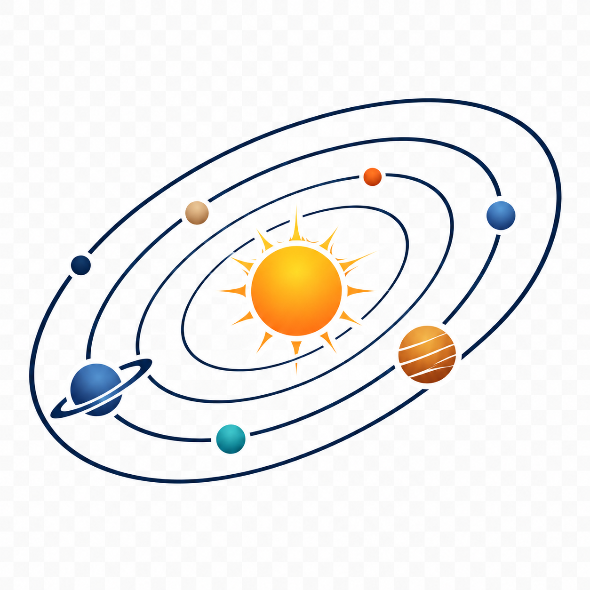
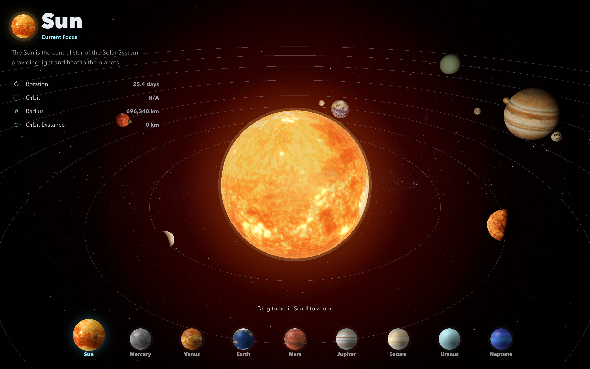

# 太阳系 3D 模拟器

[English README](README.md)

<p align="center">
  
</p>



这是一个基于 Vite、TypeScript 和原生 Three.js 构建的双语太阳系 3D 模拟器。它使用真实的等距柱状行星纹理渲染太阳和八大行星，并包含自转、公转、聚焦镜头飞行、地球云层、土星环、轨道路径和玻璃质感界面。

## 安装

```bash
npm install
```

## 纹理

模拟器需要真实纹理文件放在 `public/textures/` 中。可以运行下面的命令，从 Wikimedia Commons 下载内置的 2k Solar System Scope 纹理集：

```bash
npm run textures:download
```

必需文件：

- `public/textures/sun.jpg`
- `public/textures/mercury.jpg`
- `public/textures/venus.jpg`
- `public/textures/earth.jpg`
- `public/textures/earth_clouds.png`
- `public/textures/mars.jpg`
- `public/textures/jupiter.jpg`
- `public/textures/saturn.jpg`
- `public/textures/saturn_ring.png`
- `public/textures/uranus.jpg`
- `public/textures/neptune.jpg`
- `public/textures/stars.jpg`

推荐来源包括 [Solar System Scope Textures](https://www.solarsystemscope.com/textures/) 和 NASA 公开行星图像。项目内置下载脚本使用 Wikimedia Commons 上镜像的 [Solar System Scope](https://commons.wikimedia.org/wiki/Category:Solar_System_Scope) 2k 文件，授权协议为 Creative Commons Attribution 4.0。署名：Solar System Scope。

如果缺少纹理，加载界面会显示缺失的文件名，控制台也会输出清晰的错误信息。

## 运行

```bash
npm run dev
```

打开 Vite 在终端中输出的本地地址。

## 构建

```bash
npm run build
```

## 预览生产构建

```bash
npm run preview
```

## 控制方式

- 桌面端：滚动切换当前聚焦天体，拖拽围绕当前焦点观察。
- 移动端：纵向滑动切换当前聚焦天体，拖拽围绕当前焦点观察。
- 底部导航：点击或点按天体名称进行聚焦。

默认语言跟随 `navigator.language`；以 `zh` 开头的浏览器语言使用中文，其他语言回退到英文。

## 调整模拟参数

所有视觉尺寸、轨道距离、速度、轴倾角、纹理路径、镜头距离、地球云层和土星环配置都位于 `src/data/solarSystem.ts`。

- 修改行星尺寸：编辑 `radius`。
- 修改轨道距离：编辑 `orbitRadius`。
- 修改自转速度：编辑 `rotationSpeed`。
- 修改公转速度：编辑 `orbitSpeed`。
- 修改全局速度：编辑 `SIMULATION_CONFIG.timeScale`。
- 隐藏轨道路径：将 `SIMULATION_CONFIG.enableOrbitPaths` 设为 `false`。
- 关闭辉光：将 `SIMULATION_CONFIG.enableBloom` 设为 `false`。

如需提升移动端性能，可以降低 `src/objects/createSun.ts` 和 `src/objects/createPlanet.ts` 中的球体分段数，降低 `src/scene/createRenderer.ts` 中的像素比，或在模拟配置中关闭辉光。
